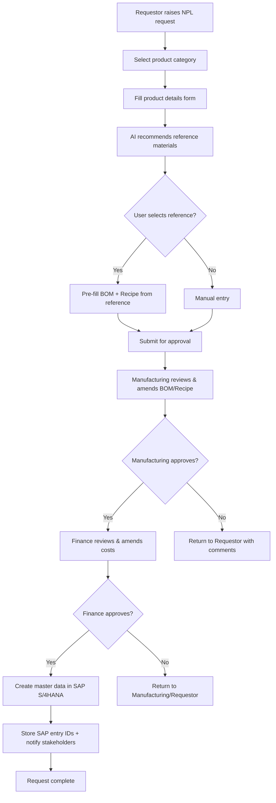
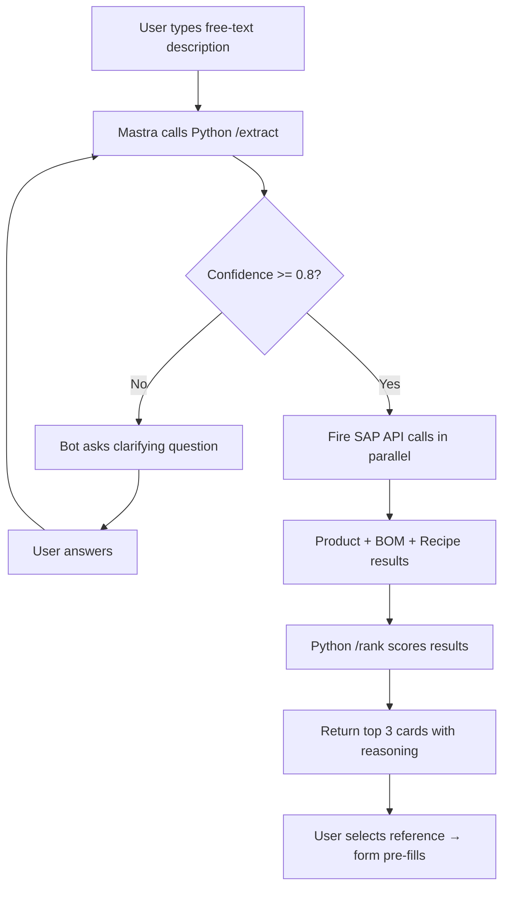
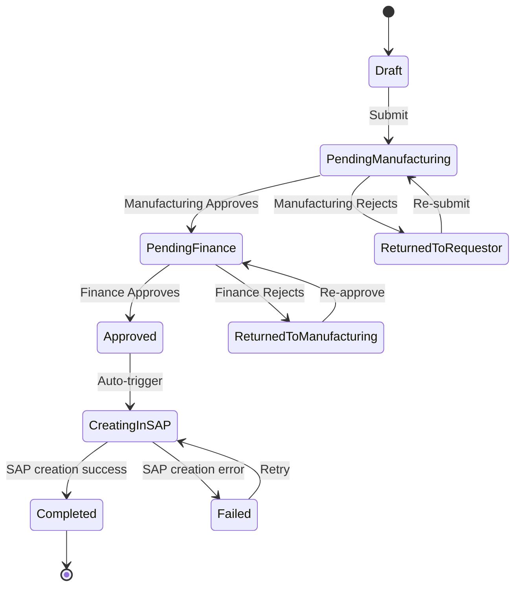

# MenaBev — New Product Launch (NPL) Application

## Technical Specification v0.2

**Project:** QLNEXA — AI-Powered New Product Launch System for MenaBev
**Date:** 2026-03-31
**Status:** DRAFT — Awaiting Review

---3

## 1. Executive Summary

MenaBev requires an enterprise-grade AI application to streamline and automate
end-to-end new product launch activities. The system provides guided request
initiation, AI-powered recommendations for reference materials / BOM / Recipe,
multi-step approval workflows, and automated SAP S/4HANA master data creation.

### 1.1 Business Objectives

- Eliminate manual master data errors in SAP
- Accelerate master data creation for new products
- Reduce effort required from business users (Finance, Manufacturing, Procurement)
- Provide AI-driven recommendations for BOM and Recipe based on similar existing products

### 1.2 Scope Items

| Item | Description |
|------|-------------|
| New Product Launch | Guided request initiation with AI recommendations |
| Product Amendment | Update existing materials |
| Mass Product Creation | Bulk creation via Excel upload and AI prompts |
| AI Recommendation Engine | Reference materials, BOM & Recipe suggestions |
| Two-Step Workflow | Manufacturing approval → Finance approval |
| Dashboard | Analytics driven by SAP data — how new products perform |
| SSO / SAML | Single Sign-On via SAP Identity Provider |
| ZATCA Integration | Auto-create request for ZATCA compliance (details TBD) |

### 1.3 Data Storage Philosophy

> [!IMPORTANT]
> **This application stores NO business data locally.** The system is fully
> transactional. All product, BOM, and recipe data lives exclusively in
> SAP S/4HANA. The only data persisted by the application is:
>
> - **SAP entry IDs** — Material Number, BOM Number, Recipe Group created
>   after successful approval
> - **Request metadata** — request ID, status, timestamps, approver info
> - **Audit trail** — who did what, when (for compliance)
>
> The AI chatbot layer is entirely transactional — chat history and
> recommendations are session-scoped and never persisted.

---

## 2. User Roles & Permissions

### 2.1 Roles (sourced from SAML assertion)

| Role | Permissions |
|------|-------------|
| **Requestor** | Create new product requests, view own requests, select AI recommendations |
| **Manufacturing** | Review requests, amend BOM/Recipe data, approve/reject manufacturing leg |
| **Finance** | Review requests, update costs, approve/reject finance leg |

### 2.2 SAML Role-Based Access Matrix

| Feature | Requestor | Manufacturing | Finance |
|---------|-----------|---------------|---------|
| Create new product request | ✅ | ❌ | ❌ |
| View own requests | ✅ | ✅ | ✅ |
| View all requests | ❌ | ✅ | ✅ |
| Amend BOM / Recipe | ❌ | ✅ | ❌ |
| Amend cost fields | ❌ | ❌ | ✅ |
| Approve manufacturing leg | ❌ | ✅ | ❌ |
| Approve finance leg | ❌ | ❌ | ✅ |
| View dashboard | ✅ | ✅ | ✅ |
| Bulk upload | ✅ | ❌ | ❌ |

> [!NOTE]
> Roles are extracted from the SAML assertion's `AttributeStatement`. The
> exact SAML attribute name for roles needs to be confirmed with the SAP
> IDP administrator.

---

## 3. System Architecture

### 3.1 High-Level Architecture

```
┌──────────────────────────────────────────────────────────────────┐
│                        React Frontend                            │
│  Landing · Product Forms · Workflow UI · AI Chat · Dashboard     │
└───────────────────────────┬──────────────────────────────────────┘
                            │ HTTPS (REST + SSE)
┌───────────────────────────▼──────────────────────────────────────┐
│           Node.js Backend (Express/Fastify + Mastra)             │
│                                                                  │
│  • SAML 2.0 Service Provider (passport-saml)                     │
│  • Session management (roles + SAP user context)                 │
│  • REST API gateway for React                                    │
│  • Approval workflow engine                                      │
│  • SAP S/4HANA API integration (OData V2 + V4)                   │
│  • Mastra agent for AI chatbot orchestration                     │
│  • SSE for streaming AI responses                                │
│  • Email notification service                                    │
│                                                                  │
│  Minimal DB: request IDs, SAP entry IDs, audit trail ONLY        │
└───────────────────────────┬──────────────────────────────────────┘
                            │ HTTP (internal)
┌───────────────────────────▼──────────────────────────────────────┐
│              Python AI Service (FastAPI)                          │
│                                                                  │
│  • /extract — NLP structured extraction (LLM)                    │
│  • /rank — scoring + match reasoning                             │
│  • /recommend-bom — BOM recommendation from similar products     │
│  • /recommend-recipe — Recipe recommendation                     │
│  • LLM: [TBD — Azure OpenAI / Ollama / other]                   │
│                                                                  │
│  Fully stateless — no data persistence                           │
└──────────────────────────────────────────────────────────────────┘

External Dependencies:
  • SAP S/4HANA (On-Premise) — OData APIs (single source of truth)
  • SAP Identity Provider — SAML 2.0 SSO
  • Cloud: AWS / Azure [TBD]
  • Database: Cosmos DB (Azure) / DynamoDB (AWS) — metadata only
```

### 3.2 Technology Stack

| Layer | Technology | Notes |
|-------|------------|-------|
| **Frontend** | React 18+ | SPA with component library |
| **Backend** | Node.js (Express or Fastify) | API gateway, auth, workflows |
| **AI Orchestrator** | Mastra (TypeScript) | Chatbot agent within Node.js |
| **AI Service** | Python 3.11+ (FastAPI) | NLP extraction, ranking, recommendations |
| **LLM** | [TBD] | Azure OpenAI / Ollama / other |
| **Database** | Cosmos DB / DynamoDB [AWS/Azure TBD] | Metadata + SAP entry IDs only — no business data stored |
| **SAP System** | S/4HANA (On-Premise) | Single source of truth for all product / BOM / recipe data |
| **Auth** | SAML 2.0 SSO | Via SAP Identity Provider |
| **Cloud** | AWS / Azure [TBD] | Hosting for all non-SAP components |
| **Containerization** | Docker + Docker Compose | Dev environment; K8s for prod [TBD] |

---

## 4. Business Process Flow

### 4.1 New Product Launch — Happy Path



### 4.2 AI Chatbot Flow (Reference Material Search)



> [!NOTE]
> The chatbot is fully transactional. No chat history or AI recommendations
> are persisted. Each session starts fresh.

### 4.3 SAP Master Data Creation (Post-Approval)

After final approval, the system creates master data in SAP in this order:

1. **Material Master** — via Product API (OData V4)
2. **Bill of Material** — via BOM API (OData V2)
3. **Master Recipe** — via Master Recipe API (OData V2)
4. **ZATCA Integration (Pending Details)** — Auto-creating request/entries for ZATCA compliance (Sending invoice/tax data from SAP to ZATCA systems). Specific details need to be gathered from the client.

Each step depends on the previous one (BOM needs Material Number, Recipe
needs BOM). After successful creation, the returned SAP entry IDs
(Material Number, BOM Number, Recipe Group) are stored in the application
database for analytics and tracking purposes.

---

## 5. SAP Integration

> [!IMPORTANT]
> **Disclaimer:** The SAP API names, entity names, and field names listed
> below are based on publicly documented SAP S/4HANA standard APIs. These
> are **presumed example endpoints**. Actual endpoints, entity sets, and
> field mappings will be confirmed after detailed discussions with the SAP
> technical team and may differ based on the specific S/4HANA version and
> custom configurations in use at MenaBev.

### 5.1 API Inventory

#### 5.1.1 Product (Material Master) — `OP_PRODUCT_0001`

- **Protocol:** OData V4
- **Purpose:** Create, Read, Update, Delete product (material) master data
- **Key Entities:**

| Entity | Description | Usage in NPL |
|--------|-------------|--------------|
| `Product` | Main material master record | Read (search similar), Create (post-approval) |
| `ProductPlant` | Plant-specific data | Read + Create — plant-level attributes |
| `ProductSales` | Sales-area data | Create — sales org, distribution channel |
| `ProductStorage` | Storage location data | Create — storage location assignments |
| `ProductDescription` | Material descriptions | Read + Create — multi-language support |

- **Key Fields for AI Search:** `Product` (MATNR), `ProductType`, `ProductGroup`, `BaseUnit`, plant-level fields
- **Key Fields for Creation:** [TBD — detailed field mapping with business users]

#### 5.1.2 Bill of Material — `API_BILL_OF_MATERIAL_SRV_0002`

- **Protocol:** OData V2
- **Purpose:** Create, Read, Update, Delete BOM header and item data
- **Key Entities:**

| Entity | Description | Usage in NPL |
|--------|-------------|--------------|
| `MaterialBOM` | BOM header | Read (search similar), Create (post-approval) |
| `MaterialBOMItem` | BOM components / items | Read + Create — component materials, quantities |
| `MaterialBOMSubItem` | Sub-items within BOM | Create — if sub-items needed |

- **Key Fields:** `Material`, `Plant`, `BOMUsage`, `BOMCategory`, item-level: `BOMComponentNumber`, `BOMItemQuantity`
- **Notes:**
  - Supports `$batch` operations for creating header + items in one call
  - OData V2 — requires CSRF token handling
  - Version management supported

#### 5.1.3 Master Recipe — `API_MASTER_RECIPE_0001`

- **Protocol:** OData V2
- **Purpose:** Read, Create, Update, Delete master recipe data
- **Key Entities:**

| Entity | Description | Usage in NPL |
|--------|-------------|--------------|
| `MasterRecipeOperation` | Main work steps | Read + Create — process operations |
| `MasterRecipePhase` | Subordinate work steps | Read + Create — detailed process phases |
| `MasterRecipeOpCompAlloc` | Component allocation (Operation level) | Create — assign materials to operations |
| `MasterRecipePhaseCompAlloc` | Component allocation (Phase level) | Create — assign materials to phases |
| `MasterRecipeOpSecdryRsce` | Secondary resources (Operation level) | Create — additional resources |
| `MasterRecipePhseSecdryRsce` | Secondary resources (Phase level) | Create — additional resources |

- **Key Fields:** `MasterRecipeGroup`, `MasterRecipe`, `MasterRecipeOperationIntID`
- **Notes:**
  - Hierarchical structure: Recipe → Operations → Phases
  - Component allocations link BOM items to specific operations/phases

### 5.2 SAP Authentication Strategy

The application needs to fulfill two concurrent authentication goals with a single user login:
1. **Feature Access Control:** Identify the user and their roles (e.g., Requestor, Manufacturing, Finance) to restrict UI features and API endpoints within the custom Node.js backend.
2. **SAP API Access:** Obtain valid credentials to call SAP S/4HANA OData APIs (Product, BOM, Recipe) on behalf of the user, so SAP can enforce its own plant-level and organizational authorizations.

There are two potential SSO protocols available via the SAP Identity Authentication Service (IAS) to achieve this: **SAML 2.0** and **OpenID Connect (OIDC)**.

#### Option A: SAML 2.0 (Legacy Approach)

```
┌──────────────┐      SAML 2.0       ┌──────────────────┐
│   Browser    │ ◄──────────────────►│   SAP IdP        │
│   (React)    │                     │  (SAML Provider) │
└──────┬───────┘                     └────────┬─────────┘
       │                                      │
┌──────▼───────┐     OAuth2 SAML     ┌────────▼─────────┐
│   Node.js    │    Bearer Grant     │   SAP S/4HANA    │
│   Backend    │ ───────────────────►│   (OData APIs)   │
│  (SAML SP)   │                     │                  │
└──────────────┘                     └──────────────────┘
```

**Flow:**
1. React app redirects to SAP IdP for login.
2. SAP IdP returns an XML SAML assertion to Node.js.
3. Node.js extracts `userId` and `roles` from the XML to build the local session.
4. For SAP API calls, Node.js uses the **OAuth2 SAML Bearer Assertion** flow to exchange the SAML assertion for an SAP-scoped OAuth2 access token.

*Pros:* Supported natively by older SAP systems.
*Cons:* Heavy XML parsing; requires secondary token exchange step for API calls; lacks native refresh token support.

#### Option B: OpenID Connect (OIDC) (Recommended Approach)

```
┌──────────────┐ Authorization Code  ┌──────────────────┐
│   Browser    │      + PKCE         │   SAP IAS        │
│   (React)    │ ◄──────────────────►│  (OIDC Provider) │
└──────┬───────┘                     └────────┬─────────┘
       │                                      │
┌──────▼───────┐                     ┌────────▼─────────┐
│   Node.js    │     access_token    │   SAP S/4HANA    │
│   Backend    │ ───────────────────►│   (OData APIs)   │
│ (OIDC Client)│                     │                  │
└──────────────┘                     └──────────────────┘
```

**Flow:**
1. React app utilizes Authorization Code flow with SAP IAS.
2. SAP IAS returns a JWT `id_token` (containing user profile and roles) and an OAuth2 `access_token`.
3. Node.js validates the `id_token` to establish the local session and feature access.
4. For SAP API calls, Node.js uses the `access_token` directly as a Bearer token (or performs an automated JWT Token Exchange if S/4HANA requires a differently scoped token).
5. Node.js uses the `refresh_token` to silently renew sessions.

*Pros:* Modern, lightweight JSON web tokens (JWT); `access_token` is inherently designed for API authorization; native session renewal.
*Cons:* SAP IAS administrator must explicitly configure the `groups` attribute to be included in the token claims.

> [!IMPORTANT]
> **Recommendation:** The system should adopt **OpenID Connect (OIDC)**. It provides a cleaner architecture, avoids XML overhead, and perfectly aligns with the dual need for identity (`id_token`) and API authorization (`access_token`) in a single flow.

#### 5.2.1 Identity Provider Configuration Requirements

Regardless of the chosen protocol, the integration service requires persistent configuration.

**Non-Sensitive Config (Stored in App DB):**
- IdP Discovery URL / Metadata URL
- Application Client ID / Entity ID
- Redirect URIs / ACS URLs
- Scopes (if OIDC: `openid profile email groups`)
- SAP API Base URL

**Sensitive Config (Stored in Azure Key Vault / AWS Secrets Manager):**
- Application Client Secret (OIDC)
- IdP and SP X.509 Certificates / Private Keys (SAML)

### 5.3 OData Integration Patterns

| Concern | Approach |
|---------|----------|
| **CSRF Tokens** | Fetch token via `HEAD` request with `X-CSRF-Token: Fetch` header before POST/PUT/DELETE (OData V2 only) |
| **Batch Operations** | Use `$batch` for multi-entity creation (BOM header + items) |
| **Error Handling** | Parse SAP OData error response body for business-level error messages |
| **Pagination** | Use `$skip` / `$top` for V2; cursor-based for V4 |
| **Filtering** | `$filter=Product eq '000000000012345'` — note: zero-padded material numbers |
| **Retry** | Exponential backoff with max 3 retries for transient failures (5xx, timeout) |
| **Token Caching** | Cache OAuth2 tokens, refresh 5 minutes before expiry |

---

## 6. AI Recommendation Engine

### 6.1 Purpose

When a user initiates a new product request, the AI engine recommends
similar existing products from SAP. The user can select a reference
product, and the system pre-fills the BOM and Recipe from that
reference — saving significant manual effort.

### 6.2 Extraction Flow

1. User describes the product in free text (e.g., "330ml glass Pepsi, Jeddah plant")
2. LLM extracts structured fields:

```json
{
  "product_description": "Pepsi",
  "packaging_type": "glass bottle",
  "volume": "330ml",
  "plant": "Jeddah",
  "confidence": 0.92
}
```

3. If `confidence < 0.8` → ask clarifying question (max 3 rounds)
4. If `confidence >= 0.8` → proceed to SAP search

> [!NOTE]
> The entire extraction and recommendation flow is transactional.
> No chat history, extracted fields, or SAP search results are
> persisted. Each session is independent.

### 6.3 SAP Search Strategy

Using the extracted fields, the system queries SAP in parallel:

| API Call | Filter Criteria | Returns |
|----------|-----------------|---------|
| Product search | `ProductDescription`, `ProductGroup`, `Plant` | Matching material masters |
| BOM search | `Material` (from product results), `Plant` | BOM headers + items for matched materials |
| Recipe search | `MasterRecipeGroup` (from product results) | Recipe operations + phases for matched materials |

### 6.4 Ranking

The Python `/rank` endpoint scores results based on:

- **Field match score** — how closely extracted fields match SAP data
- **Completeness score** — does the matched product have BOM + Recipe?
- **Recency score** — prefer recently created products

Returns **top 3 results** with match reasoning. User selects one → BOM and Recipe data pre-fills the form.

### 6.5 AI Service Endpoints

| Endpoint | Method | Input | Output |
|----------|--------|-------|--------|
| `/extract` | POST | `{ text, history[] }` | `{ fields, confidence }` |
| `/rank` | POST | `{ extracted_fields, sap_results[] }` | `{ ranked_results[], reasoning[] }` |
| `/recommend-bom` | POST | `{ reference_material, target_plant }` | `{ suggested_bom_items[] }` |
| `/recommend-recipe` | POST | `{ reference_material, target_plant }` | `{ suggested_operations[] }` |

### 6.6 LLM Configuration

| Parameter | Value |
|-----------|-------|
| Provider | [TBD — Azure OpenAI / Ollama / other] |
| Model | [TBD] |
| Hosting | AWS / Azure [TBD] |
| Temperature | 0.1 (low — for consistent structured extraction) |
| Max tokens | 1024 (extraction), 2048 (ranking with reasoning) |

---

## 7. Approval Workflow

### 7.1 Workflow States



### 7.2 Request Metadata (What We Store)

Since the application stores **no business data**, only minimal metadata
is persisted in the database:

```json
{
  "id":               "req-uuid",
  "status":           "Completed",
  "requestor": {
    "userId":         "from SAML",
    "email":          "user@menabev.com"
  },
  "approvals": [
    {
      "role":         "Manufacturing",
      "status":       "approved",
      "approver":     "mfg-user-id",
      "timestamp":    "2026-03-31T11:00:00Z",
      "comments":     "Looks good"
    },
    {
      "role":         "Finance",
      "status":       "approved",
      "approver":     "fin-user-id",
      "timestamp":    "2026-03-31T12:00:00Z",
      "comments":     null
    }
  ],
  "sapEntryIds": {
    "materialNumber": "000000000012345",
    "bomNumber":      "00012345",
    "recipeGroup":    "RCP-001"
  },
  "audit": [
    { "action": "created",     "by": "user-id", "at": "2026-03-31T10:00:00Z" },
    { "action": "approved",    "by": "mfg-id",  "at": "2026-03-31T11:00:00Z" },
    { "action": "approved",    "by": "fin-id",  "at": "2026-03-31T12:00:00Z" },
    { "action": "sap_created", "by": "system",  "at": "2026-03-31T12:01:00Z" }
  ],
  "createdAt":        "2026-03-31T10:00:00Z",
  "updatedAt":        "2026-03-31T12:01:00Z"
}
```

> [!IMPORTANT]
> No product descriptions, BOM items, recipe details, or cost data is
> stored in the application database. All business data is transient —
> it lives in the user's session during the request lifecycle and is
> written to SAP upon final approval. After SAP creation, only the
> returned entry IDs are persisted.

### 7.3 Notifications

| Event | Notify | Channel |
|-------|--------|---------|
| Request submitted | Manufacturing approvers | Email |
| Manufacturing approved | Finance approvers | Email |
| Returned for revision | Requestor | Email |
| SAP creation complete | All stakeholders | Email + In-app |
| SAP creation failed | System admin + Requestor | Email |

---

## 8. Database Design (Minimal — Metadata Only)

> [!IMPORTANT]
> The database stores **only request metadata and SAP entry IDs**. No
> product data, BOM data, recipe data, or cost data is stored. SAP
> S/4HANA is the single source of truth for all business data.

### 8.1 Collections

| Collection | Partition Key | Purpose |
|------------|---------------|---------|
| `requests` | `/requestor/userId` | Request metadata + SAP entry IDs + workflow state |
| `audit_log` | `/requestId` | All user actions for compliance and traceability |
| `config` | `/type` | Business rules, field mappings, workflow config |

### 8.2 What Is NOT Stored

- ❌ Product descriptions or form field data
- ❌ BOM items or component lists
- ❌ Recipe operations or phases
- ❌ Cost data or pricing
- ❌ Chat history or AI recommendations
- ❌ SAP search results

### 8.3 Indexing Strategy

- Composite index on `status` + `createdAt` (for workflow queue views)
- Index on `requestor.userId` (for "my requests" view)
- Index on `approvals.role` + `approvals.status` (for approver dashboards)

> [!NOTE]
> Database: Cosmos DB (Azure) / DynamoDB (AWS) [TBD]. Final cloud provider
> not yet finalized. If AWS, DynamoDB with GSIs. If Azure, Cosmos DB with
> composite indexes.

---

## 9. Frontend Design

### 9.1 Pages

| Page | Route | Role Access | Description |
|------|-------|-------------|-------------|
| Login | `/login` | All | SAML SSO redirect |
| Dashboard | `/` | All | Analytics page — loads on login, fetches data from SAP using stored IDs |
| New Request | `/request/new` | Requestor | Product form with AI chatbot sidebar |
| Request Detail | `/request/:id` | All (filtered) | View + approve / reject / amend |
| Approval Queue | `/approvals` | Mfg + Finance | Pending approvals for user's role |
| Bulk Upload | `/bulk` | Requestor | Excel upload for mass creation |
| Settings | `/settings` | Admin | Workflow config, field mappings |

### 9.2 Key UI Components

- **AI Chat Panel** — Right sidebar on New Request page; streams AI responses via SSE; session-scoped (no persistence)
- **Product Form** — Multi-step form with validation; pre-fills from AI selection
- **BOM Editor** — Table with add/remove/edit rows for BOM items
- **Recipe Editor** — Tree view for Operations → Phases hierarchy
- **Approval Card** — Shows request summary + approve/reject/comment actions
- **Dashboard Cards** — Analytics driven by SAP data, fetched on load

---

## 10. API Design (Node.js Backend)

### 10.1 REST Endpoints

| Method | Endpoint | Auth | Description |
|--------|----------|------|-------------|
| `GET` | `/api/requests` | All | List requests (filtered by role) |
| `POST` | `/api/requests` | Requestor | Create new NPL request |
| `GET` | `/api/requests/:id` | All | Get request details |
| `PUT` | `/api/requests/:id` | Requestor | Update draft request |
| `POST` | `/api/requests/:id/submit` | Requestor | Submit for approval |
| `POST` | `/api/requests/:id/approve` | Mfg/Finance | Approve with comments |
| `POST` | `/api/requests/:id/reject` | Mfg/Finance | Reject with comments |
| `GET` | `/api/requests/:id/audit` | All | Get audit trail |
| `POST` | `/api/chat` | Requestor | Chat with AI (streaming SSE) |
| `GET` | `/api/dashboard/analytics` | All | Fetch analytics — uses stored SAP IDs to query SAP for display data |
| `POST` | `/api/bulk/upload` | Requestor | Upload Excel for bulk creation |
| `GET` | `/api/sap/products?q=...` | All | Search SAP products (live query) |
| `GET` | `/auth/saml/login` | Public | Initiate SAML login |
| `POST` | `/auth/saml/callback` | Public | SAML assertion consumer |
| `GET` | `/auth/session` | All | Get current user + roles |
| `POST` | `/auth/logout` | All | Logout + destroy session |

### 10.2 SSE Streams

| Channel | Purpose |
|---------|---------|
| `SSE /api/chat/stream` | Stream AI chatbot responses |

---

## 11. Dashboard & Analytics

### 11.1 How Analytics Works (No Local Data)

Since the application stores no business data, the analytics/dashboard
page works as follows:

1. **On login / dashboard load:** The app reads all SAP entry IDs from the local `requests` collection (Material Numbers, BOM Numbers, etc.)
2. **Fetches live data from SAP:** Using those IDs, the backend calls SAP APIs to retrieve the current product data, sales data, and any other required metrics
3. **Displays analytics:** The frontend renders the data received from SAP in real-time

This ensures the dashboard always shows **current, authoritative data** from SAP — not stale cached copies.

### 11.2 KPIs

| Metric | Source | Description |
|--------|--------|-------------|
| Total requests | Local DB | Count by status (draft, pending, approved, failed) |
| Avg approval time | Local DB | Time from submission to final approval |
| Pending approvals | Local DB | Per-role count |
| SAP creation success rate | Local DB | % of approved requests successfully created in SAP |
| [TBD: Product metrics] | SAP API [TBD] | Sales data fields and APIs to extract them — to be determined |

### 11.3 SAP APIs for Analytics

> [!NOTE]
> The specific SAP APIs used to fetch analytics data (e.g., sales volumes,
> product performance) are **TBD**. These will be identified after
> discussions with the SAP team and business stakeholders regarding which
> KPIs and data points are needed on the dashboard.

---

## 12. Non-Functional Requirements

| Requirement | Target |
|-------------|--------|
| Response time (UI) | < 2 seconds for form loads |
| AI response time | < 10 seconds for extraction + ranking |
| SAP API response time | < 5 seconds per call |
| Dashboard load time | < 5 seconds (depends on SAP API response time for live data) |
| Concurrent users | ~50 (based on MenaBev team size) |
| Availability | 99.5% during business hours |
| Data retention | Audit logs retained for 7 years |
| Browser support | Chrome (latest), Edge (latest) |

---

## 13. Security

| Concern | Approach |
|---------|----------|
| Authentication | SAML 2.0 SSO — no local passwords |
| Authorization | Role-based from SAML attributes, enforced server-side |
| SAP API auth | OAuth2 SAML Bearer Assertion (user-level) |
| Data in transit | HTTPS/TLS 1.2+ everywhere |
| Data at rest | Minimal local data encrypted via cloud-managed keys |
| Data minimization | No business data stored locally; SAP is single source of truth |
| CSRF | Token-based CSRF protection on all state-changing endpoints |
| Rate limiting | Per-user rate limits on API endpoints |
| Secrets | Stored in cloud vault (Azure Key Vault / AWS Secrets Manager) |
| Audit trail | All user actions logged with timestamps |
| Input validation | Server-side validation on all inputs; sanitization for XSS |

---

## 14. Open Questions & TBDs

| # | Question | Owner | Status |
|---|----------|-------|--------|
| 1 | Which LLM to use? Azure OpenAI (GPT-4), Ollama, or other? | Tech Lead | TBD |
| 2 | Final cloud provider — AWS or Azure? | Management | TBD |
| 3 | Dashboard fields — what sales KPIs and which SAP APIs to extract them? | Business | TBD |
| 4 | Detailed field mapping — which Material Master fields does the form capture? | Business + SAP Team | TBD |
| 5 | SAP OAuth2 trust setup — has this been configured with SAP Basis? | SAP Admin | TBD |
| 5a| SSO Auth Mechanism — Will we use SAML 2.0 or OpenID Connect (OIDC) with SAP IAS for feature access and SAP API calls? | Tech Lead + SAP Admin | TBD |
| 6 | SAML attribute name for user roles — what is the claim name in the assertion? | SAP IdP Admin | TBD |
| 7 | Email service — which provider? (SendGrid, Azure Communication Services, AWS SES) | Tech Lead | TBD |
| 8 | SAP instance connectivity — VPN, ExpressRoute, or private endpoint? | Infra | TBD |
| 9 | SAP APIs for analytics — which endpoints provide sales/performance data for the dashboard? | Business + SAP Team | TBD |
| 10 | Confirm SAP API endpoints — validate that documented API names match the actual deployed services | SAP Team | TBD |
| 11 | ZATCA Integration specifics — what specific data needs to be sent to ZATCA systems for compliance during/after SAP creation? | Business + SAP Team | TBD |

---

## 15. Timeline (from PPT)

| Week | Phase | Deliverable |
|------|-------|-------------|
| W1 | Design | Detailed design, API contracts |
| W2-W3 | UI Build (Sprint 1) | React frontend, SSO integration, forms |
| W3-W5 | AI & Integration (Sprint 2) | Python AI service, SAP integration, Mastra chatbot |
| W5-W6 | Integration Build | Wire all components, workflow engine |
| W6-W7 | UAT / Business Testing | End-to-end testing with business users |
| W7-W8 | Training & Go-Live | User training, deployment, monitoring |

---

## 16. Glossary

| Term | Definition |
|------|------------|
| NPL | New Product Launch |
| BOM | Bill of Material — list of components/ingredients for a product |
| Master Recipe | Manufacturing process definition — operations and phases |
| MATNR | SAP Material Number |
| WERKS | SAP Plant Code |
| STLNR | SAP BOM Number |
| OData | Open Data Protocol — REST-like API standard used by SAP |
| SAML | Security Assertion Markup Language — SSO protocol |
| Cosmos DB | Azure's globally distributed NoSQL database |
| Mastra | TypeScript AI agent orchestration framework |
| SLM | Small Language Model |

---

*End of Specification v0.2*
