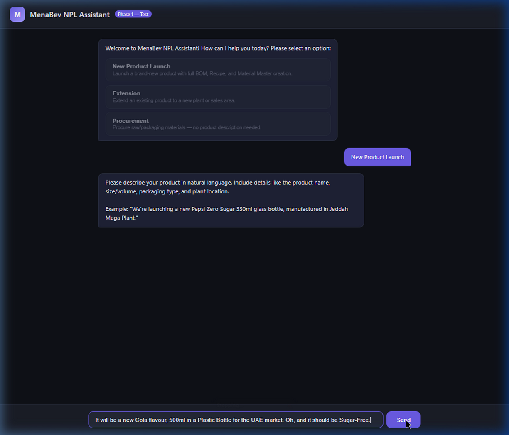
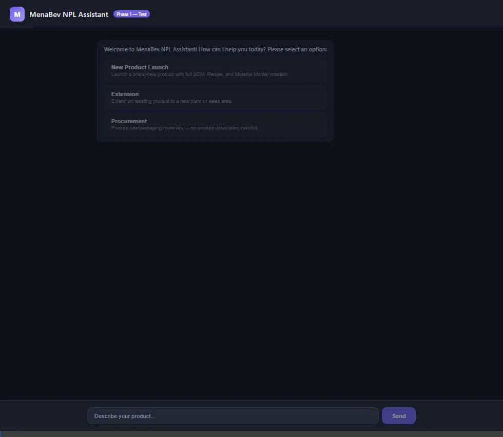

# Phase1-NLP-Walkthrough
Branch: `phase1-nlp-walkthrough`

## Completion Overview
The implementation and testing of the Phase 1 backend chat endpoint and NLP field extraction pipeline are complete. We successfully unblocked the AI agent interaction using working Gemini API keys and verified the end-to-end user journey. 

### Key Deliverables Verified
1. **Node.js (TypeScript) Backend:** The Fastify server properly hosts the Mastra AI agent and exposes the `/api/chat` orchestration layer. 
2. **Python AI Service:** The FastAPI endpoint successfully interprets the Mastra payload to extract and structure fields via the Gemini SDK.
3. **End-to-End Chat UI Test:** The test UI routes user intents immediately, determines context/state (like missing fields), asks contextual questions, and correctly identifies and extracts semantic entities ("Sugar-Free Cola", "500ml", "Plastic Bottle") from unstructured continuous queries.

## Validation Results
We successfully ran an automated test of the entire conversational loop. The extraction now properly completes with the configured API keys.

````carousel

<!-- slide -->

````

> [!SUCCESS] API keys active & Phase 1 Completed
> The NLP field extraction backend is completely operational and successfully pulling context via Gemini models. The system successfully reaches the "ready to search SAP" validation completion state.
